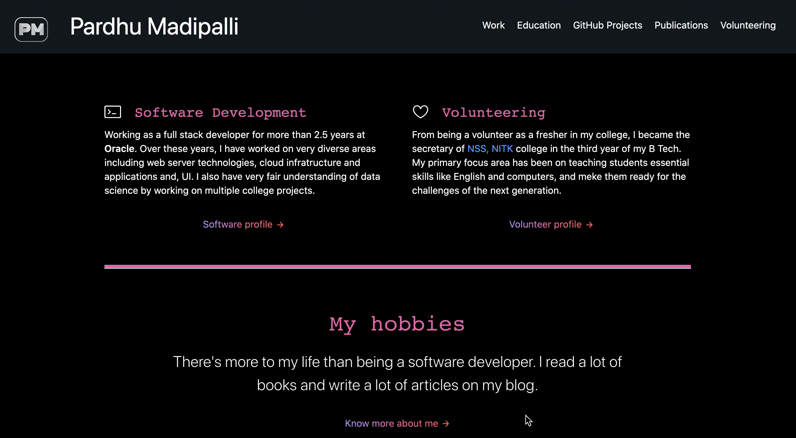

# Pardhu Madipalli profile

- Developed using Jekyll
- Hosted by GitHub
- Developed with the help of GitHub project [Government Github](https://government.github.com/).

### Website

<a href="https://pardhumadipalli.github.io">

</a>
<br/>

### How to build the website locally

- Install Ruby. Find various ways to install Ruby [here](https://www.ruby-lang.org/en/documentation/installation/).
- Install bundler
```bash
gem install bundler
```
- Install the gems using bundle
```bash
bundle install
```
- Run the Jekyll server locally using
```bash
bundle exec jekyll serve
```
